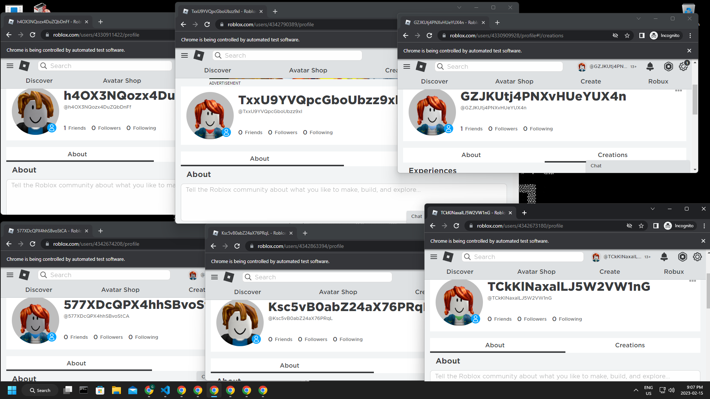

# Roblox Bot Generator

Generate and log in to multiple Roblox accounts.



## Install Dependencies

Install the necessary dependencies.

```text
pip install -r requirements.txt
```

## Notes

'new pool_1.txt' - Create a new file to store accounts.

'gen \<int> file.txt' - Generate accounts and store them in a file.

'log pool_1.txt' - Automatically log in to all accounts in a file.

'quit' - Quit the program.

All funcaptas must be completed manually.
